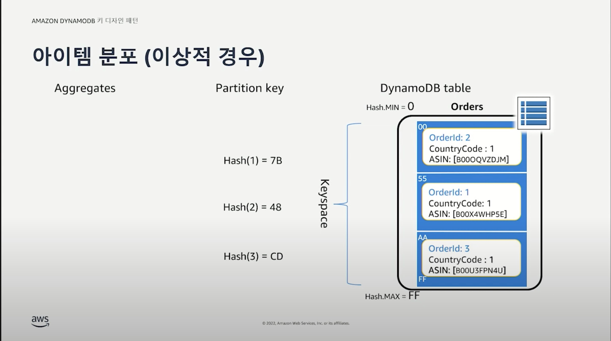

# Amazon DynamoDB 키 디자인 패턴 Webinar

- https://www.youtube.com/watch?v=I7zcRxHbo98

## 중요 컨셉

### Table Structure

- 가장 큰 단위는 테이블
- 하나의 테이블에는 무한대에 가까운 아이템을 넣을 수 있다. (RDBMS의 row)
- 아이템은 키와 속성으로 구성
- RDBMS에서는 column이라고 하는데 DynamoDB는 attribute라는 용어를 사용한다.
- PK 덕분에 낮은 지연시간으로 아이템을 찾을 수 있다.
- Key
  - Partition Key (PK): 내가 찾고자 하는 아이템이 어떤 파티션에 있는지 where로 찾을 수 있게 해주는 키
    - 등호연산자, 범위 연산자, begins with, between과 같은 연산자를 사용할 수 있다.
  - Sort Key (SK)
    - 오름차순, 내림차순 정렬로 데이터를 조회할 수 있다.

### Primary Key

- PK + SK를 합쳐서 Primary Key라고 한다.
- 오직 Primary Key로만 검색이 가능하다. (Scan은 제외)
- Primary Key가 없으면 조회가 불가능하다. => 그래서, Access Pattern이 RDBMS보다 중요하다.

### 데이터베이스 스케일링

- 전통적인 RDBMS는 보통 스케일업
- NoSQL은 많은 샤드로 스케일 아웃 전략을 사용

### 작업 방식

- 테이블 단위로 작업을 하면 DynamoDB가 내부적으로 나머지를 알아서 잘 처리한다.

  - 여러 파티션에 나누어서 저장하고, 이러한 파티션의 관리는 DynamoDB가 알아서 해준다.

- 각 파티션이란 단위는 다음과 같은 제약사항을 가진다.
  - 초당 1000개의 쓰기 (1K WCU)
  - 초당 3000개의 읽기 (3K RCU)
  - 10GB의 데이터 저장만 가능
  - **Key Design 할때 기억해야할 중요한 조건 중 하나이다.**

### 수평적 스케일링

- 트래픽이 증가하면서 파티션의 개수가 늘어난다.
  - 각 파티션은 제약사항이 있으므로 처리량은 늘어날 수 없다.
- **여러 개의 파티션이 골고루 사용될 수 있도록 키를 디자인하는 점이 중요하다.**

### 아이템 분포 (이상적 경우)

- PK는 OrderId
- 단순히 1,2,3 을 통해서 파티션을 분할한다면 1번 파티션에 모든 데이터가 저장된다. 나머지 파티션은 놀게 되므로 비효울적이 된다. 그래서 DynamoDB는 PK에 해시함수를 적용해서 파티션을 선택하여 저장한다.

### 데이터 복제

- 파티션은 3개의 가용영역(AZ)에 복제된다.

## 제약 조건

### 스케일링

- RDBMS와 다르게 쓰기/읽기를 독립적으로 사용할 수 있다.

- DynamoDB는 아이템이 한글자만 바뀌어도 다시쓴다.
- 가능한 아이템의 사이즈는 적게 유지하고, 아이템의 사이즈를 늘리는 것이 좋다.
- DynamoDB가 잘하는 것은 PK, SK를 사용해서 특정 아이템을 찾는 것을 잘한다.

- DynamoDB는 REST API를 통해서 데이터를 읽어온다.
- 데이터 -> 데이터 스토어의 역할로 볼 수 있다.
- GetItem
  - 10KB의 한개 아이템을 Eventually Consistency로 읽는다면 2RCU를 사용한다.

- RDBMS의 full scan과 같다고 보면 된다.
- DynamoDB는 1MB씩 읽는게 가능하고 토큰값을 이용해 계속해서 읽을 수 있다.
- 마이그레이션할때 사용할만한 API

- bulk 작업보다는 여러시점에 나눠서 일어나는 작업이 더 좋다.

- Transact로 시작하는 Operations은 RDBMS의 Transaction과 비슷하다.
  - RCU, WCU가 2배이상 사용되기 때문에 최소한으로 사용하는 것이 중요하다.

### GSI (Global Secondary Index)

- RDBMS의 대표적인 기능이지만 NoSQL이 닮아가고싶은 Secondary Index
- 추가나 삭제가 자유롭다.
- 그래서 서비스 요구사항 등에 따라 검색 등이 필요할 떄 GIS를 사용할 수 있다.

### LSI (Local Secondary Index)

- GSI랑 다르게 테이블을 생성하는 시점에서만 생성이 가능하다. 그리고 삭제가 불가능하다.
- 그래서 일반적으로는 사용을 권장하지는 않는다.

### LSI VS GSI

- **LSI는 Strong Consistency가 필요하다면 사용을 고려해볼 수 있다.**
- 가능하다면 Secondary Index를 가능하다면 줄이면 좋다. 왜나하면, 비용이 들기 때문이다.

## Tenet

- RDBMS처럼 Entity 별로 테이블을 만들지 말자.
- 최대한 빠르게 조회할 수 있도록 키를 디자인하자.

- 이번 웨비나에서 가장 중요한 한장
- Use Case를 정의
- full serverless 환경
- DynamoDB에서는 하나의 테이블을 사용하는 것이 여러개로 나뉜 테이블을 사용하는 것보다 좋다.
- OLTP 환경이 더 적합. OLAP 분석은 DynamoDB 웹으로 분석 파이프라인을 만들어서 수행해야한다.

## 디자인 패턴 및 비정규화

### 비정규화

- 비정규화란 데이터 중복을 최소화하는 정규화와 반대되는 개념
- 예전에는 CPU 비용보다 디스크 비용이 더 비싸기 때문에 정규화를 했었다.

### PK + SK 복합키

- 위의 예시에서 Partition Key는 FirstName이고 Sort Key는 LastName이다.
- 하나의 Partition Key에 여러 개의 Sort Key가 결합될 수 있다.

- key 디자인 시 생각해볼 포인트는 내가 보여줄 UI를 그대로 저장하는 것이다.
- UI에 따라 데이터 액세스 패턴이 달라지기 때문이다.

### 싱글 테이블 디자인

- 애플리케이션의 모든 엔티티를 하나의 테이블에서 접근할 수 있도록 하는 것
- **시계열, 다른 액세스 패턴**의 엔티티는 적합하지 않다.

- 엔티티 별로 테이블을 만들면 운영비용이 결국 증가해서 관리형을 사용하는 이유가 없어진다.
