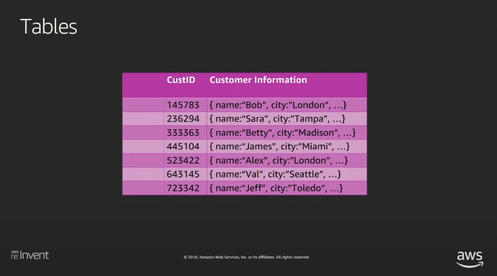

# Amazon dynamodb under the hood how we built a hyper scale database

## Onboarding to Amazon DynamoDB

- How dyanmodb works

## What is the Goal

- Learn about features
- Understand tools
- Use DynamoDB more effectively

- 의도대로 사용하면 더 좋은 결과를 얻을 수 있다.
- 내부 구조를 이해하면 더 잘 쓸 수 있다.

## Agenda

- GetItem / PutItem
- Auto Scaling
- Backup Restore
- Streams
- Global Tables

## GetItem

- Request Router

- 네트워크를 통해서 요청이 들어오면 RequestRouter를 타고 AWS의 모든 컴포넌트가 사용하는 Authentication System으로 라우팅된다.
- Authentication System은 요청이 유효한지 확인하고, 유효하다면 요청을 처리할 수 있는 컴포넌트로 라우팅한다.

위의 그림은 IAM Policy를 보여준다. IAM Policy는 어떤 요청을 처리할 수 있는지에 대한 권한을 정의한다. 위의 예시에서는 DynamoDB의 GetItem 요청을 처리할 수 있는 권한을 정의하고 있다.

인증을 통과하면 요청은 Request Router에 의해 Storage Node에 도달한다.

- 리더 노드의 local에 데이터를 저장하고, 다른 노드로 복제한다.
- 3개의 노드는 매우 가까운 거리에 있어서 네트워크 지연이 거의 없다.

## DynamoDB evolved from Dynamo

- DynamoDB는 Dynamo의 개선된 버전이다.
- 예전에 작성했던 paper(논문)과는

## Paxos

- The Part-Time Parliament (Parliament는 의회라는 뜻)
- The Part-Time Parliament -> Paxos Made Simple이라는 논문을 작성
- Paxos is a way of getting a bunch of distributed machines to all agree on a certain value
- https://en.wikipedia.org/wiki/Paxos_(computer_science)

- DynamoDB는 Paxos를 사용해서 스토리지 노드들 사이에서 파티셔너, 테이블을 위한 리더를 선출한다.
- PutItem요청은 Leader Node로 보내진다.
- The leader is always up-to-date: 리더는 모든 변경사항을 알고있다.

- 리더 노드는 주기적으로 다른 노드에게 Heartbeat를 보낸다.
- 그 주기는 1.5초
- Heartbeat가 유실된다면, 리밸런싱이 수행되어 리더를 재선출한다.

## DynamoDB request router and storage nodes

DynamoDB는 3개의 스토리지 않에 하나의 request router를 가지고 있지않다.

- 여러 가용영역에 걸쳐서 request router와 storage node를 가지고있다.

- request router는 stateless이다. 그래서 어떤 request router에게 요청을 보내도 상관없다.
- request router는 leader storage node로 요청을 보내고 다른 가용영역의 storage node까지 도달할 수 있다.

- 파티션 메타데이터 시스템 (partition-metadata system)
- 여러 스토리지 노드 중 어떤 노드가 리더인지 알기 위해서, 파티션 메타데이터 시스템을 사용한다.
- 하위 시스템

## How dynamodb sets up a table

- 테이블을 만들때는 primary key를 지정해야한다. (정확히는 primary hash key)

hash function은 공개되지 않았지만 항상 동일한 결과가 나올 것이다. 위의 예시에서는 customerID가 primary 키이고 내부적으로 Hash value를 가지고 정렬되어 있다.

hash value에 따라서 파티션이 나뉜다. 예를들어 1번 파티션에는 Ox???? ~ 0x???? 까지 들어가고, 2번 파티션에는 0x???? ~ 0x???? 까지 나뉜다. 정확하게 어떤 방식으로 나뉘는지는 아직 모르겠다.

hash value와 storage node를 매핑한다. Paxos algorithm을 통해 리더가 될 사람을 선택하는 것은 가용 영역의 해당 스토리지 노드에 달려있다.
